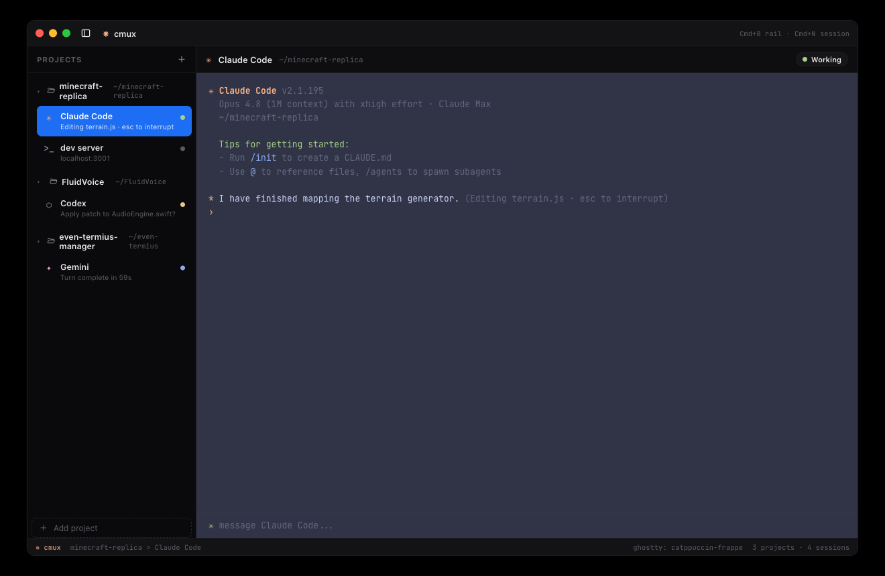
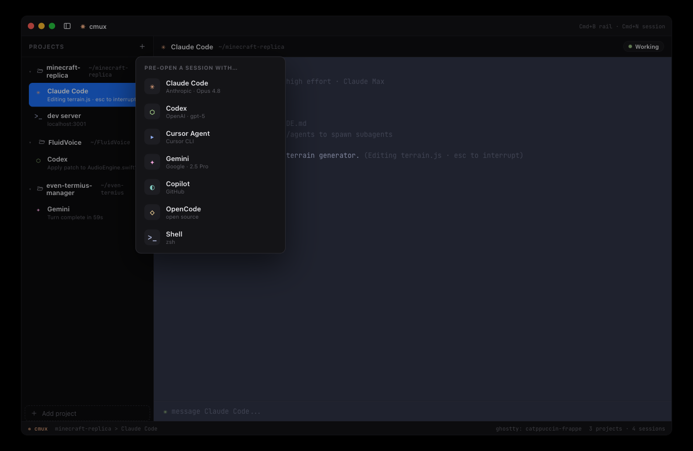
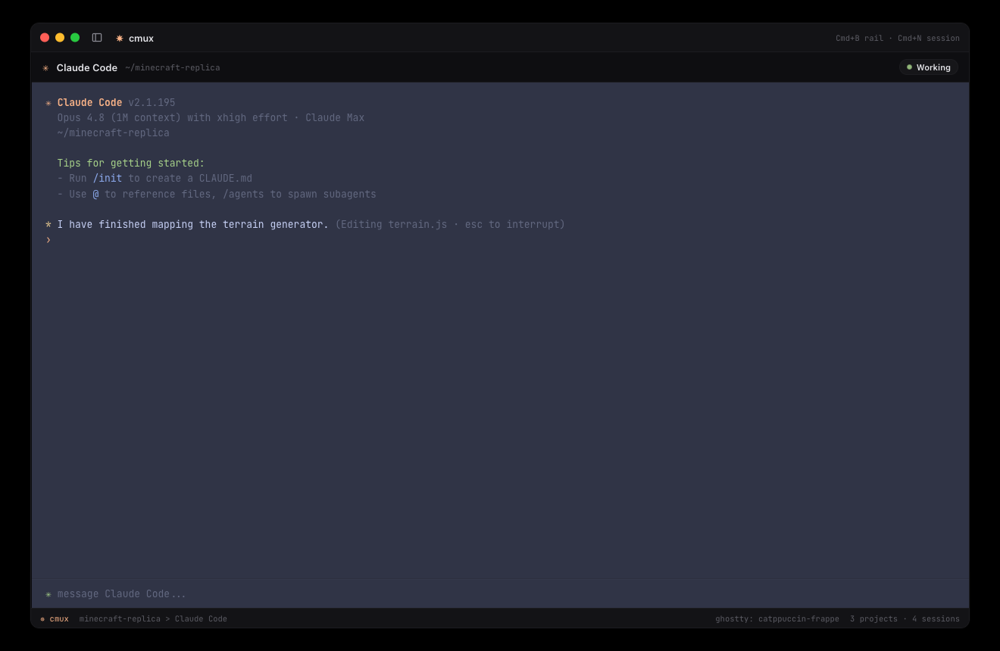

# the-sacred-terminal

A terminal workspace organized around **projects and agents**, not terminal tabs.
cmux-style collapsible side rail · folder-tree projects · pre-open sessions by agent (Claude Code, Codex, Gemini, …) · Ghostty theming.

Status: **prototype**.

## Repo layout

```
docs/
  mock-design/        interactive HTML mock (open index.html in a browser)
    index.html
    screenshots/
  specs/
    spec.md           the spec
```

## See it

- **Mock:** open [`docs/mock-design/index.html`](docs/mock-design/index.html) directly in any browser — no build step.
- **Spec:** [`docs/specs/spec.md`](docs/specs/spec.md)

## Previews

| Default | Agent picker | Rail collapsed |
|---|---|---|
|  |  |  |
