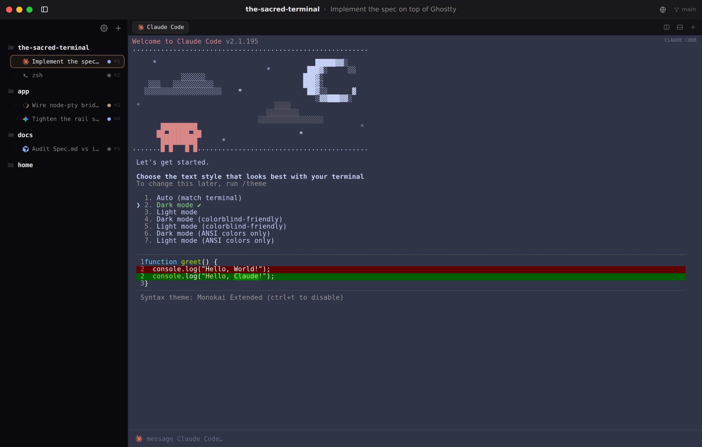
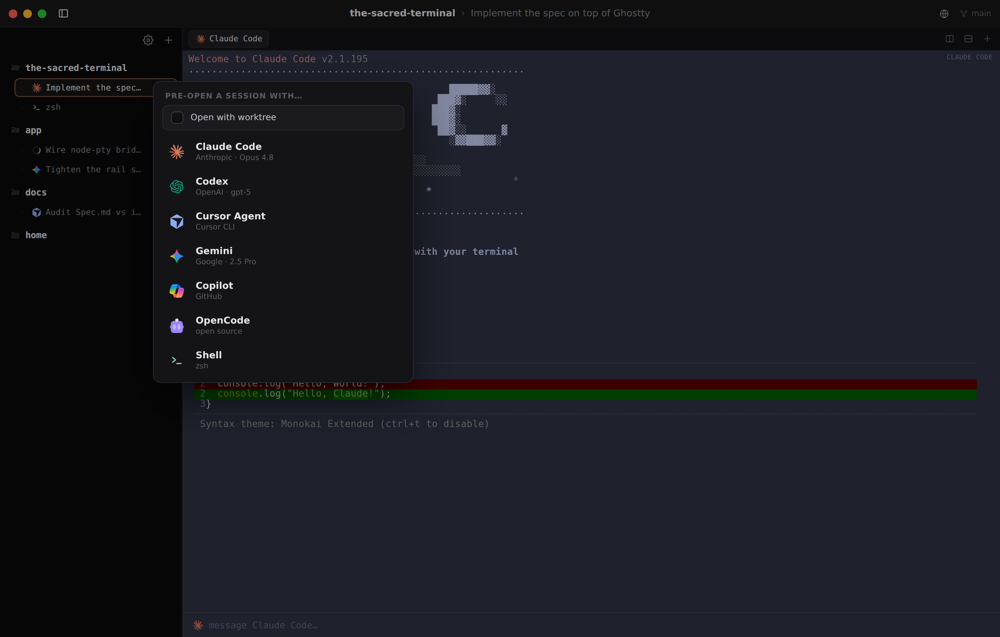
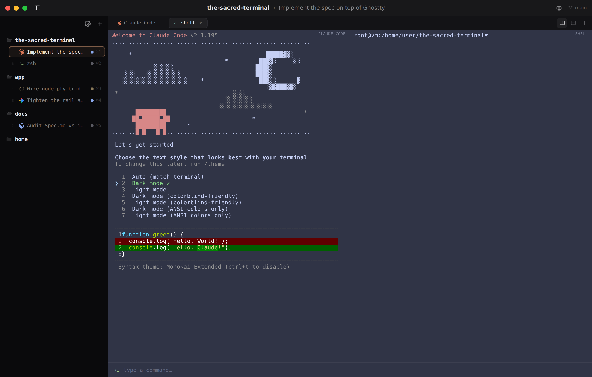
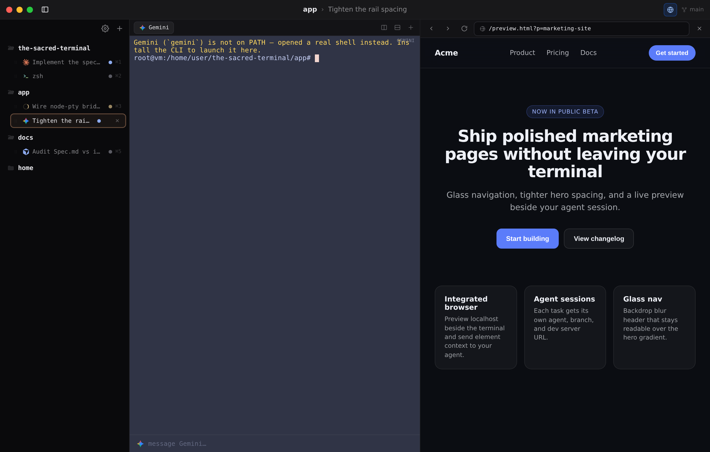
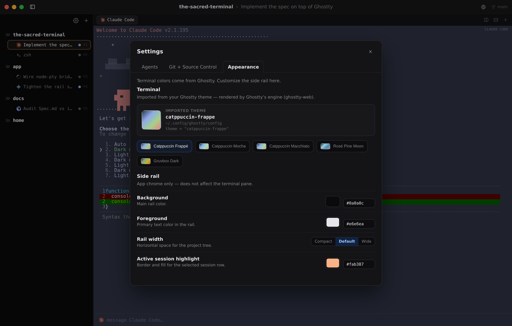
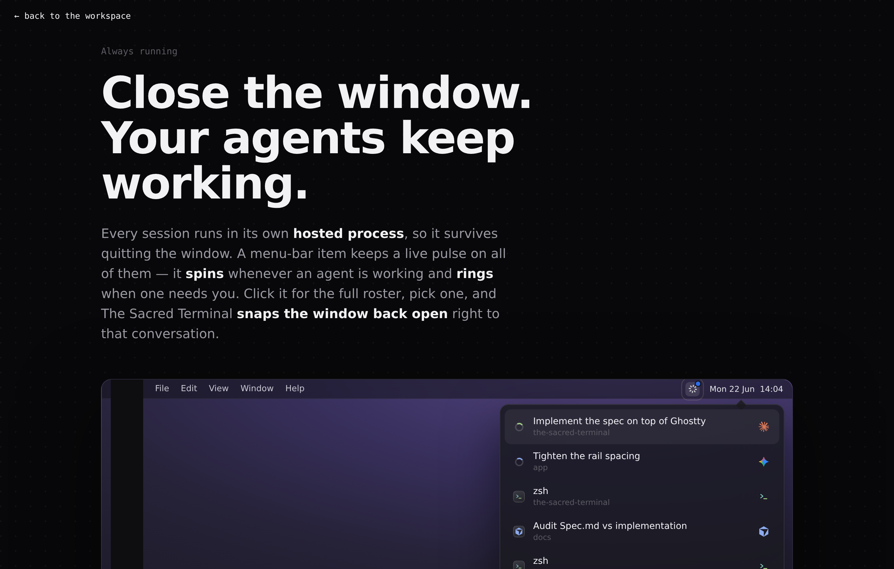

# the-sacred-terminal

A terminal workspace organized around **projects and agents**, not terminal tabs.
cmux-style collapsible side rail · folder-tree projects · pre-open sessions by agent (Claude Code, Codex, Gemini, …) · "always running" menu-bar monitor · integrated browser · Ghostty theming.

## The app — real, on Ghostty

[`app/`](app/) is a **runnable** implementation, modeled on [cmux](https://github.com/manaflow-ai/cmux) and built **on top of Ghostty**:

- **Terminal engine:** [`ghostty-web`](https://github.com/coder/ghostty-web) — Ghostty's terminal core (libghostty) compiled to WebAssembly. The same engine cmux embeds natively.
- **Real PTYs:** a Node + `ws` + `node-pty` bridge spawns real shells / agent CLIs at each project's directory, streamed to the browser. Sessions are *hosted* — they keep running after a tab detaches and replay scrollback on reattach.
- **UI:** React + TypeScript + Vite implementing [`docs/specs/spec.md`](docs/specs/spec.md): project rail, agent-bound sessions with a live status model, Ghostty-style terminal tabs + splits, an integrated browser pane, the agent pre-open picker (YOLO mode), settings, and the menu-bar monitor.
- **Theme:** Ghostty's Catppuccin Frappé by default; swap any bundled palette to re-skin every pane at once.

```bash
cd app && npm install && npm run dev   # http://localhost:5173
```

See [`app/README.md`](app/README.md) for details (and why a web app rather than the native Swift/AppKit cmux stack).

### The app in action

| Workspace (real Claude Code via Ghostty) | Agent pre-open picker | Terminal splits (Claude + shell) |
|---|---|---|
|  |  |  |

| Integrated browser | Settings · Appearance (Ghostty themes) | Menu-bar monitor ("always running") |
|---|---|---|
|  |  |  |

## Design mock

The original zero-build HTML/CSS/JS design mock (the source of truth for the look) lives in [`docs/mock-design/`](docs/mock-design/):

```
docs/
  mock-design/        interactive HTML mocks (open in a browser — no build step)
    index.html        main window: rail + projects + sessions
    menu-bar.html     "always running" menu-bar monitor
  specs/
    spec.md           the spec
  app-screenshots/    screenshots of the running app
```

- **Main window mock:** [`docs/mock-design/index.html`](docs/mock-design/index.html)
- **Menu-bar monitor mock:** [`docs/mock-design/menu-bar.html`](docs/mock-design/menu-bar.html)
- **Spec:** [`docs/specs/spec.md`](docs/specs/spec.md)
