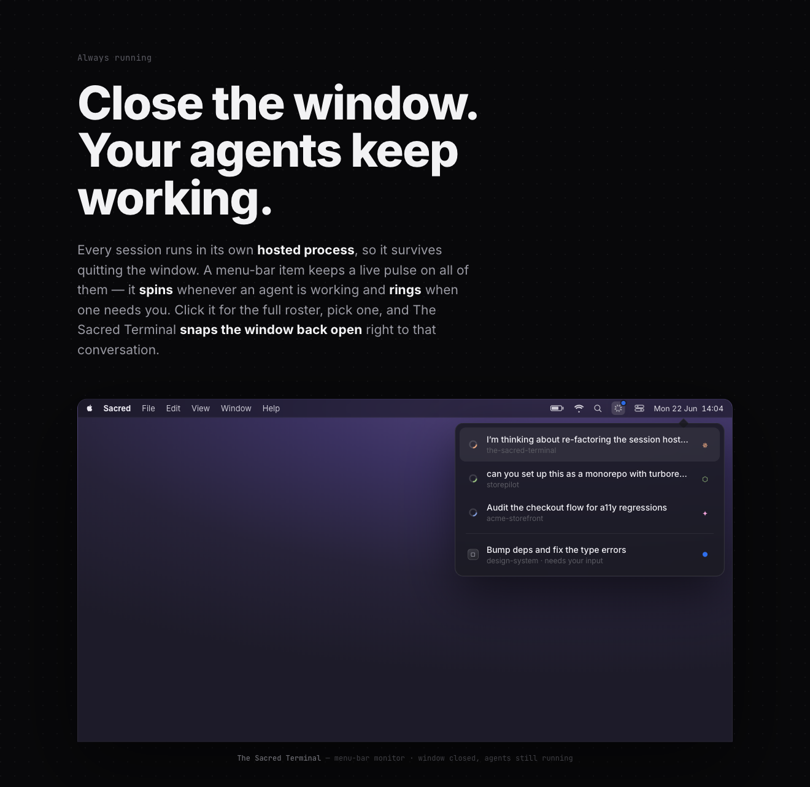

# the-sacred-terminal

A terminal workspace organized around **projects and agents**, not terminal tabs.
cmux-style collapsible side rail · folder-tree projects · pre-open sessions by agent (Claude Code, Codex, Gemini, …) · "always running" menu-bar monitor · integrated browser · Ghostty theming.

Status: **prototype**.

## Repo layout

```
docs/
  mock-design/        interactive HTML mocks (open in a browser — no build step)
    index.html        main window: rail + projects + sessions
    menu-bar.html     "always running" menu-bar monitor
    screenshots/
  specs/
    spec.md           the spec
```

## See it

- **Main window:** [`docs/mock-design/index.html`](docs/mock-design/index.html)
- **Menu-bar monitor:** [`docs/mock-design/menu-bar.html`](docs/mock-design/menu-bar.html)
- **Spec:** [`docs/specs/spec.md`](docs/specs/spec.md)

## Previews

### Main window

| Default | Agent picker | Rail collapsed |
|---|---|---|
|  |  |  |

### Always running — menu-bar monitor


